# Architecture: AI-Powered Discovery Engine (Deliverable 1)

---

## 1. Design Rationale

> **Why this architecture exceeds sentiment analysis and review summarization**

The project requirements explicitly state: *"Your workflow should go beyond summarizing reviews or performing sentiment analysis."*

This engine differs from sentiment analysis in four structural ways:

1. **Multi-dimensional extraction, not polarity scoring.** Sentiment analysis produces a single score (positive/negative/neutral). This engine extracts seven structured dimensions per comment — save reason, purchase barriers, missing information, decision stage, external behaviour, segment clues, and intent type — producing a rich, queryable dataset.

2. **Opportunity scoring with business context.** Raw frequencies are insufficient. The 5-factor scoring model (frequency × severity × closeness-to-purchase × segment clarity × non-discount solvability) ranks opportunities by *actionable business impact*, not just prevalence.

3. **Metric tree mapping.** Each opportunity is mapped to a specific node in the wishlist-to-purchase conversion tree, making the connection between user pain and business metric explicit and auditable.

4. **Hypothesis generation for primary research.** The engine's terminal output is not a dashboard — it is a set of *ranked, evidence-backed hypotheses* ready for validation in Part 3 user interviews. This makes the engine a research instrument, not a reporting tool.

---

## 2. Feature Tiers (Minimum Viable Engine)

To enable time-boxed execution, features are prioritized into three tiers:

### P0 — Must Ship (Days 1–4)

| Feature | Rationale |
|---|---|
| Hero summary with dynamic stats | First impression for reviewer; loads from computed data |
| Tab 1: Opportunity ranking with evidence | Core deliverable — ranked opportunities with quotes |
| Tab 4: Evidence explorer (searchable table) | Credibility — reviewer can verify claims |
| Tab 5: Data & methodology | Transparency — shows data volume, taxonomy, limitations |
| Sidebar filters (platform, segment, stage, confidence) | Interactivity — proves this is a real engine |
| Pre-computed full analysis | Fast page load, reliable |

### P1 — Should Ship (Day 5)

| Feature | Rationale |
|---|---|
| Tab 2: Barrier analysis (bar charts, grouped by platform/segment) | Deepens insight |
| Tab 3: Metric tree (Plotly treemap) | Bridges Part 1 → Part 2 |
| Sankey diagram (save reason → barrier → decision stage) | Visual flow of user journey |
| Live re-run on 15 samples | Proves engine is real, not static |
| Interview hypothesis export | Bridges Part 1 → Part 3 |

### P2 — Nice to Have

| Feature | Rationale |
|---|---|
| "How to read this" info panel | Onboarding for first-time viewers |
| Async classification for speed | Optimization |
| Advanced metric tree interactivity | Polish |

> [!IMPORTANT]
> **If time runs short:** Ship P0 only. A clean, credible P0 engine with 3 opportunities and real evidence outscores a buggy P0+P1 engine every time.

---

## 3. System Architecture Overview

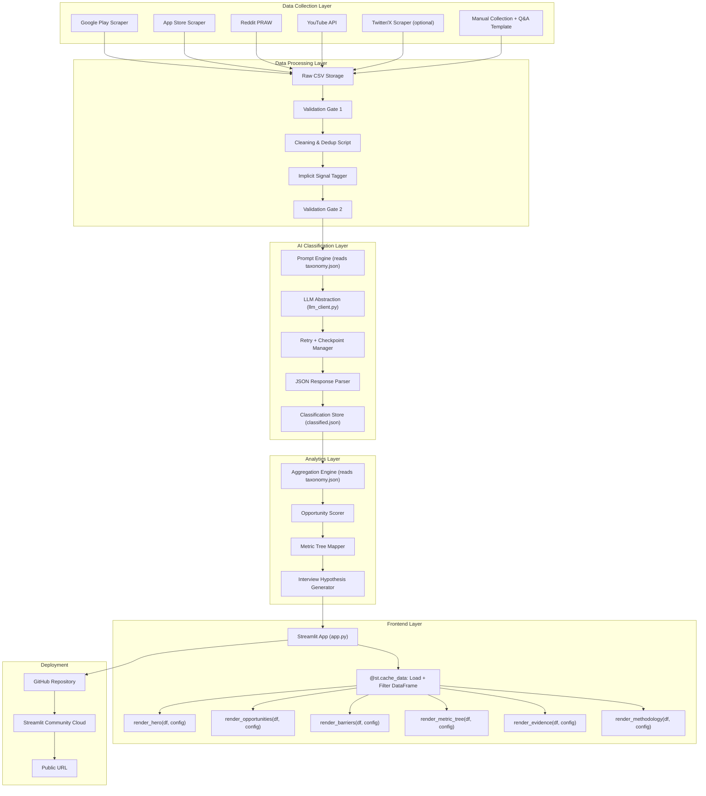

---

## 4. Repository Structure

```
myntra-discovery-engine/
│
├── app.py                          # Streamlit main application
├── requirements.txt                # Python dependencies
├── .env.example                    # Template for required environment variables
├── .gitignore                      # Excludes .env, __pycache__, etc.
│
├── .streamlit/
│   ├── config.toml                 # Streamlit theme configuration
│   └── secrets.toml                # API keys (local only, not committed)
│
├── config/
│   ├── __init__.py
│   ├── taxonomy.json               # ★ SINGLE SOURCE OF TRUTH for all categories
│   ├── settings.py                 # All configurable parameters (scraper, API, app)
│   └── prompts.py                  # Prompt templates (reads taxonomy.json dynamically)
│
├── models/
│   ├── __init__.py
│   └── schemas.py                  # Pydantic models: Review, Classification, Aggregation
│
├── utils/
│   ├── __init__.py
│   ├── llm_client.py              # ★ LLM abstraction: BaseLLMClient → Gemini/OpenAI/Groq
│   ├── retry.py                    # Exponential backoff decorator
│   ├── logger.py                   # Structured logging configuration
│   └── validators.py              # Validation gates between pipeline stages
│
├── data/
│   ├── raw/
│   │   ├── google_play_reviews.csv
│   │   ├── app_store_reviews.csv
│   │   ├── reddit_posts.csv
│   │   ├── youtube_comments.csv
│   │   ├── twitter_posts.csv       # Optional
│   │   └── manual_collection.csv
│   ├── processed/
│   │   ├── cleaned_reviews.csv     # Deduplicated, filtered
│   │   └── tagged_reviews.csv      # With implicit signal tags
│   ├── results/
│   │   ├── classified.json         # Full AI classification output
│   │   ├── classification_checkpoint.json  # ★ Resume point on failure
│   │   ├── aggregated.json         # Aggregation results (initial load)
│   │   ├── opportunities.json      # Ranked opportunity scores
│   │   ├── interview_hypotheses.md # ★ Generated hypotheses for Part 3
│   │   └── verification_log.csv    # Manual verification results
│   └── templates/
│       └── product_qa_template.csv # ★ Template for manual Q&A collection
│
├── scripts/
│   ├── __init__.py
│   ├── scrape_google_play.py       # Google Play review scraper
│   ├── scrape_app_store.py         # App Store review scraper
│   ├── scrape_reddit.py            # Reddit post/comment scraper
│   ├── scrape_youtube.py           # YouTube comment scraper
│   ├── scrape_twitter.py           # ★ Twitter/X scraper (optional, graceful skip)
│   ├── clean_data.py               # Cleaning and dedup pipeline
│   ├── tag_signals.py              # Implicit wishlist signal tagger
│   ├── classify.py                 # AI classification runner (with checkpoint)
│   ├── aggregate.py                # Aggregation and scoring
│   ├── generate_hypotheses.py      # ★ Interview hypothesis generator
│   └── verify.py                   # Manual verification helper
│
├── components/
│   ├── __init__.py
│   ├── hero.py                     # render_hero(df, config)
│   ├── opportunity_tab.py          # render_opportunities(df, config)
│   ├── barrier_tab.py              # render_barriers(df, config)
│   ├── metric_tree_tab.py          # render_metric_tree(df, config) — Plotly treemap
│   ├── evidence_tab.py             # render_evidence(df, config)
│   ├── methodology_tab.py          # render_methodology(df, config)
│   └── charts.py                   # Reusable chart helpers (Plotly)
│
├── tests/
│   ├── __init__.py
│   ├── test_clean.py               # ★ Tests for cleaning pipeline
│   ├── test_tag.py                 # ★ Tests for signal tagging
│   ├── test_aggregate.py           # ★ Tests for aggregation logic
│   ├── test_scoring.py             # ★ Tests for opportunity scoring
│   └── test_schemas.py             # ★ Tests for Pydantic model validation
│
└── README.md
```

> [!NOTE]
> Items marked with ★ are new additions from the architecture review. `__init__.py` files are included in all packages to enable proper Python imports.

---

## 5. Backend Design

### 5.1 Configuration Management (`config/settings.py`)

All configurable parameters are centralized in a single settings file, not hardcoded in scripts:

```python
"""Centralized configuration — edit this file, not individual scripts."""
from pathlib import Path
from dotenv import load_dotenv
import os

load_dotenv()

# ── Paths ──
PROJECT_ROOT = Path(__file__).parent.parent
DATA_RAW = PROJECT_ROOT / "data" / "raw"
DATA_PROCESSED = PROJECT_ROOT / "data" / "processed"
DATA_RESULTS = PROJECT_ROOT / "data" / "results"
TAXONOMY_PATH = PROJECT_ROOT / "config" / "taxonomy.json"

# ── LLM Provider ──
LLM_PROVIDER = os.getenv("LLM_PROVIDER", "gemini")  # "gemini" | "openai" | "groq"
GEMINI_API_KEY = os.getenv("GEMINI_API_KEY", "")
OPENAI_API_KEY = os.getenv("OPENAI_API_KEY", "")
GROQ_API_KEY = os.getenv("GROQ_API_KEY", "")

LLM_MODELS = {
    "gemini": "gemini-1.5-flash",
    "openai": "gpt-4o-mini",
    "groq": "llama-3.1-8b-instant",
}

# ── Scraper Parameters ──
GOOGLE_PLAY_APP_ID = "com.myntra.android"
GOOGLE_PLAY_COUNT = 500
APP_STORE_APP_NAME = "myntra"
APP_STORE_APP_ID = "907394059"
APP_STORE_COUNT = 200
REDDIT_SUBREDDITS = ["IndianFashionAddicts", "india", "fashionadvice"]
REDDIT_KEYWORDS = [
    "myntra wishlist", "myntra size", "myntra return",
    "saved for later", "didn't buy", "waiting for sale",
]
YOUTUBE_SEARCH_QUERIES = ["myntra haul", "myntra review", "myntra sizing"]
YOUTUBE_MAX_VIDEOS = 15

# ── Cleaning ──
FUZZY_DEDUP_THRESHOLD = 90  # percent
MIN_REVIEW_LENGTH = 10  # characters

# ── Classification ──
CALIBRATION_COUNT = 20
CLASSIFICATION_BATCH_DELAY = 0.5  # seconds between API calls
MAX_RETRIES = 3
RETRY_BASE_DELAY = 1.0  # seconds, exponential backoff

# ── Opportunity Scoring ──
# Factors computed automatically: frequency, severity, closeness
# Factors requiring analyst input: segment_clarity, non_discount_solvability
SCORE_NORMALIZATION_MAX = 100
```

### 5.2 Environment Variables (`.env.example`)

```env
# ── LLM Provider (choose one) ──
LLM_PROVIDER=gemini
GEMINI_API_KEY=your_gemini_api_key_here
# OPENAI_API_KEY=your_openai_api_key_here
# GROQ_API_KEY=your_groq_api_key_here

# ── Reddit API ──
REDDIT_CLIENT_ID=your_reddit_client_id
REDDIT_CLIENT_SECRET=your_reddit_client_secret
REDDIT_USER_AGENT=discovery-engine/1.0

# ── YouTube API ──
YOUTUBE_API_KEY=your_youtube_api_key

# ── Twitter/X (optional) ──
# TWITTER_BEARER_TOKEN=your_twitter_bearer_token
```

### 5.3 Data Collection Pipeline

Each scraper outputs a **standardized CSV** with the common schema:

```
source_platform, source_url, date, review_text, product_mentioned, rating, country_language
```

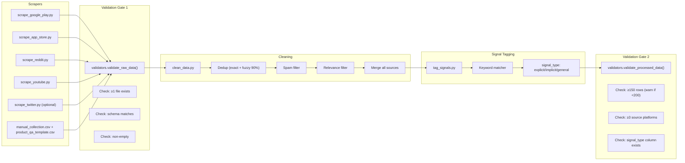

#### Scraper details

**`scrape_google_play.py`**
```python
from google_play_scraper import Sort, reviews
from config.settings import GOOGLE_PLAY_APP_ID, GOOGLE_PLAY_COUNT, DATA_RAW
from utils.logger import get_logger
from utils.retry import retry_with_backoff

logger = get_logger(__name__)

@retry_with_backoff(max_retries=3)
def scrape():
    logger.info(f"Scraping {GOOGLE_PLAY_COUNT} Google Play reviews for {GOOGLE_PLAY_APP_ID}")
    result, _ = reviews(
        GOOGLE_PLAY_APP_ID,
        lang='en', country='in',
        sort=Sort.NEWEST,
        count=GOOGLE_PLAY_COUNT,
        filter_score_with=None
    )
    # Filter for fashion/wishlist-related keywords
    # Output: data/raw/google_play_reviews.csv
    logger.info(f"Scraped {len(result)} reviews")
    return result
```

**`scrape_reddit.py`**
```python
import praw
from config.settings import DATA_RAW, REDDIT_SUBREDDITS, REDDIT_KEYWORDS
from utils.logger import get_logger
import os

logger = get_logger(__name__)

reddit = praw.Reddit(
    client_id=os.getenv('REDDIT_CLIENT_ID'),
    client_secret=os.getenv('REDDIT_CLIENT_SECRET'),
    user_agent=os.getenv('REDDIT_USER_AGENT', 'discovery-engine/1.0')
)
# Search subreddits from settings
# Keywords from settings
# Output: data/raw/reddit_posts.csv
```

**`scrape_youtube.py`**
```python
from googleapiclient.discovery import build
from config.settings import YOUTUBE_SEARCH_QUERIES, YOUTUBE_MAX_VIDEOS, DATA_RAW
from utils.logger import get_logger
from utils.retry import retry_with_backoff
import os

logger = get_logger(__name__)

youtube = build('youtube', 'v3', developerKey=os.getenv('YOUTUBE_API_KEY'))
# Search queries from settings
# Extract comments from top videos
# Output: data/raw/youtube_comments.csv
```

**`scrape_app_store.py`**
```python
from app_store_scraper import AppStore
from config.settings import APP_STORE_APP_NAME, APP_STORE_APP_ID, APP_STORE_COUNT, DATA_RAW
from utils.logger import get_logger

logger = get_logger(__name__)

app = AppStore(country="in", app_name=APP_STORE_APP_NAME, app_id=APP_STORE_APP_ID)
app.review(how_many=APP_STORE_COUNT)
# Output: data/raw/app_store_reviews.csv
```

**`scrape_twitter.py` (optional)**
```python
"""
Optional Twitter/X scraper. Gracefully skips if TWITTER_BEARER_TOKEN is not set.
Falls back to manual collection if API access is unavailable.
"""
from utils.logger import get_logger
import os

logger = get_logger(__name__)

BEARER_TOKEN = os.getenv('TWITTER_BEARER_TOKEN')
if not BEARER_TOKEN:
    logger.warning("TWITTER_BEARER_TOKEN not set — skipping Twitter scrape. "
                   "Use manual collection to supplement data from Twitter/X.")
else:
    # Use tweepy or requests with Twitter API v2
    # Search: "myntra wishlist", "myntra size", "myntra fit"
    # Output: data/raw/twitter_posts.csv
    pass
```

#### Product Q&A template (`data/templates/product_qa_template.csv`)

```csv
source_platform,source_url,date,review_text,product_mentioned,rating,country_language
product_qa,https://www.myntra.com/...,2026-08-20,"Question: Does this run true to size? Answer: ...",kurta-set-12345,,IN/en
```

> [!TIP]
> Browse Myntra product pages and copy Q&A entries that reveal sizing, fit, quality, or styling uncertainties. Target 20–30 entries. This is the only data source that requires fully manual effort.

#### Cleaning pipeline (`clean_data.py`)

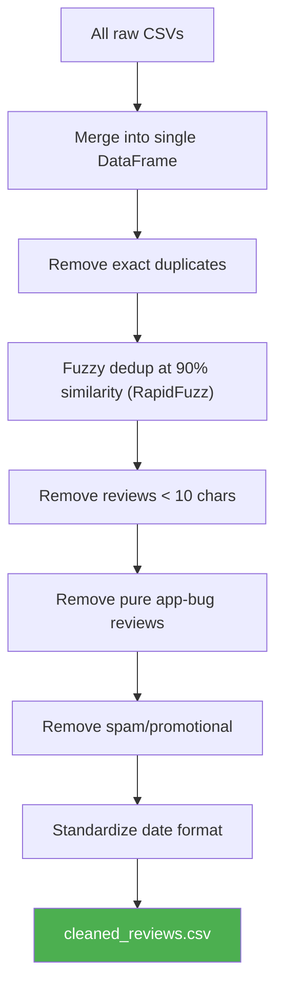

#### Signal tagger (`tag_signals.py`)

Scans each review for proxy keywords and assigns `signal_type`:

```python
EXPLICIT_KEYWORDS = [
    "wishlist", "wishlisted", "wish list", "saved to wishlist"
]
IMPLICIT_KEYWORDS = [
    "saved for later", "bookmarked", "keeping an eye",
    "thinking of buying", "might get", "still deciding",
    "added to cart but", "left in cart", "waiting for sale",
    "too expensive right now", "choosing between",
    "can't decide", "shortlisted", "not sure about size",
    "wish I could try", "need it for wedding",
    "looking for diwali"
]

def tag_signal(text):
    text_lower = text.lower()
    if any(kw in text_lower for kw in EXPLICIT_KEYWORDS):
        return "explicit"
    elif any(kw in text_lower for kw in IMPLICIT_KEYWORDS):
        return "implicit"
    else:
        return "general"  # Still analyzed, lower weight
```

> [!NOTE]
> The keyword tagger provides an *initial* signal type. During AI classification (Section 5.5), the LLM may produce a more accurate `signal_confidence` field. The AI classification's `signal_confidence` is authoritative and overrides the keyword tagger's label for analysis purposes.

---

### 5.4 Taxonomy — Single Source of Truth (`config/taxonomy.json`)

> [!IMPORTANT]
> **`taxonomy.json` is the single source of truth for all categories.** Both `prompts.py` (prompt generation) and `aggregate.py` (counting) read from this file. Never hardcode taxonomy strings in any other file. A taxonomy change only requires editing this one file.

```json
{
  "version": "1.0",
  "last_updated": "2026-08-20",
  "save_reason": {
    "categories": [
      "aspiration", "event_planning", "comparison", "price_watch",
      "availability_watch", "bookmark", "gift_consideration"
    ],
    "description": "Why the user saved or wishlisted the item"
  },
  "purchase_barriers": {
    "categories": [
      "fit_uncertainty", "quality_uncertainty", "price_concern",
      "trust_issues", "decision_overload", "delivery_return_friction",
      "styling_uncertainty", "stock_availability", "social_validation",
      "occasion_mismatch"
    ],
    "multi_select": true,
    "description": "What prevents the purchase"
  },
  "missing_information": {
    "categories": [
      "sizing_details", "material_feel", "visual_accuracy",
      "use_case_styling", "social_proof", "alternative_comparison"
    ],
    "multi_select": true,
    "description": "Unanswered questions after wishlisting"
  },
  "decision_stage": {
    "categories": [
      "browsing", "saving", "evaluating", "ready_to_buy", "abandoned"
    ],
    "description": "Where the user is in the purchase journey"
  },
  "external_behaviour": {
    "categories": [
      "youtube_search", "social_media", "friends_family",
      "competitor_comparison", "offline_trial", "google_search"
    ],
    "multi_select": true,
    "description": "What users do outside the app before purchasing"
  }
}
```

### 5.5 Pydantic Schemas (`models/schemas.py`)

Runtime-validated data models for all pipeline stages:

```python
from pydantic import BaseModel, Field, HttpUrl
from typing import Optional
from enum import Enum

class SignalType(str, Enum):
    explicit = "explicit"
    implicit = "implicit"
    general = "general"

class Confidence(str, Enum):
    high = "high"
    medium = "medium"
    low = "low"

class Review(BaseModel):
    """Schema for a single review record at any pipeline stage."""
    id: str
    source_platform: str
    source_url: str
    date: str
    review_text: str
    product_mentioned: str = "general"
    rating: Optional[int] = None
    country_language: str = "IN/en"
    signal_type: SignalType = SignalType.general

class Classification(BaseModel):
    """Schema for AI classification output per review."""
    save_reason: str
    purchase_barriers: list[str]
    missing_information: list[str]
    decision_stage: str
    external_behaviour: list[str]
    user_segment_clues: str
    signal_confidence: Confidence
    key_quote: str
    insight_summary: str

class ClassifiedReview(BaseModel):
    """A review with its AI classification attached."""
    id: str
    source_platform: str
    source_url: str
    date: str
    review_text: str
    rating: Optional[int] = None
    signal_type: str
    classification: Classification

class OpportunityScore(BaseModel):
    """Schema for a ranked opportunity."""
    rank: int
    name: str
    frequency: int = Field(ge=1, le=5)
    severity: int = Field(ge=1, le=5)
    closeness_to_purchase: int = Field(ge=1, le=5)
    segment_clarity: int = Field(ge=1, le=5)
    non_discount_solvability: int = Field(ge=1, le=5)
    total_score: float
    matching_comments: int
    matching_pct: float
    primary_segment: str
    hypothesis: str
    metric_tree_node: str
    top_unresolved_questions: list[str]
    evidence_quotes: list[dict]
```

### 5.6 LLM Abstraction Layer (`utils/llm_client.py`)

> [!IMPORTANT]
> **Default provider is Google Gemini (free tier).** The abstraction allows switching to OpenAI or Groq by changing one env var (`LLM_PROVIDER`), without modifying any pipeline code.

```python
from abc import ABC, abstractmethod
from config.settings import (
    LLM_PROVIDER, LLM_MODELS,
    GEMINI_API_KEY, OPENAI_API_KEY, GROQ_API_KEY
)
from utils.retry import retry_with_backoff
from utils.logger import get_logger

logger = get_logger(__name__)

class BaseLLMClient(ABC):
    """Abstract base for LLM providers."""

    @abstractmethod
    def classify(self, system_prompt: str, user_prompt: str) -> dict:
        """Send classification request, return parsed JSON dict."""
        pass

class GeminiClient(BaseLLMClient):
    def __init__(self):
        import google.generativeai as genai
        genai.configure(api_key=GEMINI_API_KEY)
        self.model = genai.GenerativeModel(LLM_MODELS["gemini"])
        logger.info("Initialized Gemini client")

    @retry_with_backoff(max_retries=3)
    def classify(self, system_prompt: str, user_prompt: str) -> dict:
        response = self.model.generate_content(
            f"{system_prompt}\n\n{user_prompt}",
            generation_config={"response_mime_type": "application/json"}
        )
        return json.loads(response.text)

class OpenAIClient(BaseLLMClient):
    def __init__(self):
        from openai import OpenAI
        self.client = OpenAI(api_key=OPENAI_API_KEY)
        self.model = LLM_MODELS["openai"]
        logger.info("Initialized OpenAI client")

    @retry_with_backoff(max_retries=3)
    def classify(self, system_prompt: str, user_prompt: str) -> dict:
        response = self.client.chat.completions.create(
            model=self.model,
            messages=[
                {"role": "system", "content": system_prompt},
                {"role": "user", "content": user_prompt}
            ],
            response_format={"type": "json_object"}
        )
        return json.loads(response.choices[0].message.content)

class GroqClient(BaseLLMClient):
    def __init__(self):
        from groq import Groq
        self.client = Groq(api_key=GROQ_API_KEY)
        self.model = LLM_MODELS["groq"]
        logger.info("Initialized Groq client")

    @retry_with_backoff(max_retries=3)
    def classify(self, system_prompt: str, user_prompt: str) -> dict:
        response = self.client.chat.completions.create(
            model=self.model,
            messages=[
                {"role": "system", "content": system_prompt},
                {"role": "user", "content": user_prompt}
            ],
            response_format={"type": "json_object"}
        )
        return json.loads(response.choices[0].message.content)

def get_llm_client() -> BaseLLMClient:
    """Factory: returns the configured LLM client."""
    clients = {
        "gemini": GeminiClient,
        "openai": OpenAIClient,
        "groq": GroqClient,
    }
    provider = LLM_PROVIDER.lower()
    if provider not in clients:
        raise ValueError(f"Unknown LLM_PROVIDER: {provider}. Use: {list(clients.keys())}")
    return clients[provider]()
```

### 5.7 Retry & Logging Utilities

**`utils/retry.py`**
```python
import time
import functools
from utils.logger import get_logger

logger = get_logger(__name__)

def retry_with_backoff(max_retries=3, base_delay=1.0, exceptions=(Exception,)):
    """Decorator: retries with exponential backoff on failure."""
    def decorator(func):
        @functools.wraps(func)
        def wrapper(*args, **kwargs):
            for attempt in range(max_retries + 1):
                try:
                    return func(*args, **kwargs)
                except exceptions as e:
                    if attempt == max_retries:
                        logger.error(f"{func.__name__} failed after {max_retries} retries: {e}")
                        raise
                    delay = base_delay * (2 ** attempt)
                    logger.warning(f"{func.__name__} attempt {attempt + 1} failed: {e}. "
                                   f"Retrying in {delay:.1f}s...")
                    time.sleep(delay)
        return wrapper
    return decorator
```

**`utils/logger.py`**
```python
import logging
import sys

def get_logger(name: str) -> logging.Logger:
    """Returns a configured logger with structured output."""
    logger = logging.getLogger(name)
    if not logger.handlers:
        handler = logging.StreamHandler(sys.stdout)
        handler.setFormatter(logging.Formatter(
            "%(asctime)s | %(levelname)-7s | %(name)s | %(message)s",
            datefmt="%Y-%m-%d %H:%M:%S"
        ))
        logger.addHandler(handler)
        logger.setLevel(logging.INFO)
    return logger
```

### 5.8 Validation Gates (`utils/validators.py`)

```python
"""Validation gates between pipeline stages. Fail fast with clear messages."""
import pandas as pd
from pathlib import Path
from utils.logger import get_logger

logger = get_logger(__name__)

def validate_raw_data(raw_dir: Path, required_schema: list[str]) -> bool:
    """Gate 1: Validate raw data before cleaning."""
    csv_files = list(raw_dir.glob("*.csv"))
    if not csv_files:
        raise FileNotFoundError(f"No CSV files found in {raw_dir}. Run scrapers first.")

    total_rows = 0
    for f in csv_files:
        df = pd.read_csv(f)
        missing_cols = set(required_schema) - set(df.columns)
        if missing_cols:
            raise ValueError(f"{f.name} missing columns: {missing_cols}")
        total_rows += len(df)
        logger.info(f"✓ {f.name}: {len(df)} rows, schema valid")

    if total_rows == 0:
        raise ValueError("All raw CSVs are empty. Check scrapers.")
    logger.info(f"Gate 1 passed: {total_rows} total raw rows across {len(csv_files)} files")
    return True

def validate_processed_data(processed_path: Path, min_rows: int = 150) -> bool:
    """Gate 2: Validate processed data before classification."""
    df = pd.read_csv(processed_path)

    if len(df) == 0:
        raise ValueError(f"Processed file is empty: {processed_path}")
    if len(df) < min_rows:
        logger.warning(f"⚠ Only {len(df)} rows (target: {min_rows}+). "
                       f"Consider supplementing with manual collection.")
    if "signal_type" not in df.columns:
        raise ValueError("Missing 'signal_type' column. Run tag_signals.py first.")

    platforms = df["source_platform"].nunique()
    if platforms < 3:
        logger.warning(f"⚠ Only {platforms} source platforms (target: 3+). "
                       f"Consider adding more sources.")

    logger.info(f"Gate 2 passed: {len(df)} rows, {platforms} platforms")
    return True

def validate_classification(classified_path: Path) -> bool:
    """Gate 3: Validate classification output before aggregation."""
    import json
    with open(classified_path) as f:
        data = json.load(f)

    if not data:
        raise ValueError("Classification output is empty.")
    if len(data) < 100:
        logger.warning(f"⚠ Only {len(data)} classified reviews. Results may not be robust.")

    logger.info(f"Gate 3 passed: {len(data)} classified reviews")
    return True
```

### 5.9 AI Classification Pipeline (with Checkpoint/Resume)

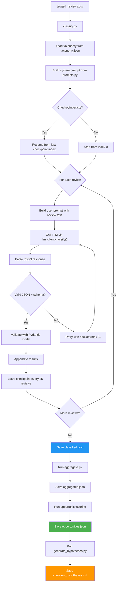

#### Checkpoint/Resume mechanism

```python
"""classify.py — with checkpoint/resume support"""
import json
from pathlib import Path
from config.settings import DATA_RESULTS, CLASSIFICATION_BATCH_DELAY
from utils.llm_client import get_llm_client
from utils.logger import get_logger
from models.schemas import Classification
import time

logger = get_logger(__name__)
CHECKPOINT_PATH = DATA_RESULTS / "classification_checkpoint.json"
CHECKPOINT_INTERVAL = 25  # Save checkpoint every N reviews

def load_checkpoint() -> tuple[int, list]:
    """Load checkpoint if it exists. Returns (start_index, existing_results)."""
    if CHECKPOINT_PATH.exists():
        with open(CHECKPOINT_PATH) as f:
            checkpoint = json.load(f)
        logger.info(f"Resuming from checkpoint: index {checkpoint['last_index'] + 1} "
                    f"({len(checkpoint['results'])} already classified)")
        return checkpoint["last_index"] + 1, checkpoint["results"]
    return 0, []

def save_checkpoint(index: int, results: list):
    """Save progress checkpoint."""
    with open(CHECKPOINT_PATH, "w") as f:
        json.dump({"last_index": index, "results": results}, f)
    logger.info(f"Checkpoint saved at index {index} ({len(results)} results)")

def classify_reviews(reviews: list, mode: str = "full"):
    client = get_llm_client()
    start_index, results = load_checkpoint() if mode == "full" else (0, [])

    for i, review in enumerate(reviews[start_index:], start=start_index):
        try:
            response = client.classify(system_prompt, build_user_prompt(review))
            classification = Classification(**response)  # Pydantic validation
            results.append({"review": review, "classification": classification.dict()})

            if (i + 1) % CHECKPOINT_INTERVAL == 0:
                save_checkpoint(i, results)

            time.sleep(CLASSIFICATION_BATCH_DELAY)  # Rate limiting

        except Exception as e:
            logger.error(f"Failed to classify review {i}: {e}")
            save_checkpoint(i - 1, results)  # Save progress before failing
            raise

    # Final save
    output_path = DATA_RESULTS / "classified.json"
    with open(output_path, "w") as f:
        json.dump(results, f, indent=2)
    logger.info(f"Classification complete: {len(results)} reviews → {output_path}")

    # Clean up checkpoint
    if CHECKPOINT_PATH.exists():
        CHECKPOINT_PATH.unlink()
```

#### Prompt generation (`config/prompts.py`)

```python
"""Prompt templates — reads taxonomy from taxonomy.json dynamically."""
import json
from config.settings import TAXONOMY_PATH

def load_taxonomy() -> dict:
    with open(TAXONOMY_PATH) as f:
        return json.load(f)

def build_system_prompt(product_name: str = "Myntra") -> str:
    taxonomy = load_taxonomy()

    # Dynamically build taxonomy section from taxonomy.json
    taxonomy_text = ""
    for dimension, config in taxonomy.items():
        if dimension in ("version", "last_updated"):
            continue
        cats = " | ".join(config["categories"])
        multi = " (multi-select)" if config.get("multi_select") else ""
        taxonomy_text += f"- {dimension}: [{cats}]{multi}\n"

    return f"""You are an expert user researcher analyzing public reviews and comments about
online fashion shopping in India, specifically about {product_name}.

Your task is to extract structured signals related to wishlist behaviour and
purchase decision-making. Focus on understanding WHY users save items and
what PREVENTS them from purchasing.

For each comment, extract the following fields. Use ONLY the categories
listed. If a field does not apply, use "not_applicable".

TAXONOMY:
{taxonomy_text}
Additional fields:
- user_segment_clues: free text describing observable user characteristics
- signal_confidence: high | medium | low
- key_quote: the most relevant 1-2 sentence excerpt, verbatim
- insight_summary: a one-sentence insight in your own words

Return your response as a JSON object."""

def build_user_prompt(review: dict) -> str:
    return f"""Analyze the following review from {review['source_platform']}:

---
"{review['review_text']}"
---

Source URL: {review['source_url']}
Date: {review['date']}
Rating: {review.get('rating', 'N/A')}"""
```

#### Classification output schema (`classified.json`)

```json
[
  {
    "id": "gp_001",
    "source_platform": "google_play",
    "source_url": "https://play.google.com/...",
    "date": "2026-07-15",
    "review_text": "Loved this kurta but wasn't sure about the fit...",
    "rating": 3,
    "signal_type": "implicit",
    "classification": {
      "save_reason": "event_planning",
      "purchase_barriers": ["fit_uncertainty", "quality_uncertainty"],
      "missing_information": ["sizing_details", "material_feel"],
      "decision_stage": "evaluating",
      "external_behaviour": ["youtube_search", "friends_family"],
      "user_segment_clues": "occasion shopper, female, 25-30 age range",
      "signal_confidence": "high",
      "key_quote": "Loved this kurta but wasn't sure about the fit for my body type, ended up asking my friend who bought it",
      "insight_summary": "Occasion shopper delays purchase due to fit uncertainty, seeks external validation from friends"
    }
  }
]
```

#### Aggregation output schema (`aggregated.json`)

```json
{
  "total_reviews": 347,
  "sources": {
    "google_play": 156,
    "app_store": 72,
    "reddit": 68,
    "youtube": 38,
    "manual": 13
  },
  "barrier_frequency": {
    "fit_uncertainty": { "count": 146, "pct": 42.1 },
    "quality_uncertainty": { "count": 97, "pct": 28.0 },
    "price_concern": { "count": 84, "pct": 24.2 }
  },
  "barrier_by_platform": {},
  "barrier_by_segment": {},
  "intent_distribution": {
    "genuine_purchase": { "count": 168, "pct": 48.4 },
    "comparison": { "count": 89, "pct": 25.6 },
    "bookmark": { "count": 52, "pct": 15.0 },
    "price_watch": { "count": 38, "pct": 11.0 }
  },
  "missing_info_frequency": {}
}
```

#### Opportunity scoring output (`opportunities.json`)

```json
[
  {
    "rank": 1,
    "name": "Fit confidence for occasion-led shoppers",
    "scores": {
      "frequency": 5,
      "severity": 5,
      "closeness_to_purchase": 4,
      "segment_clarity": 4,
      "non_discount_solvability": 5
    },
    "total_score": 87,
    "matching_comments": 146,
    "matching_pct": 42.1,
    "primary_segment": "Occasion shoppers (wedding, festival)",
    "top_unresolved_questions": [
      "Will this fit my body type?",
      "How does the fabric drape in real life?",
      "What size should I order?"
    ],
    "evidence_quotes": [
      {
        "text": "Loved this kurta but wasn't sure...",
        "source_url": "https://...",
        "platform": "google_play"
      }
    ],
    "hypothesis": "Users saving outfits for occasions delay because they cannot predict fit on their body type.",
    "metric_tree_node": "consideration_to_intent.information_completeness"
  }
]
```

### 5.10 Interview Hypothesis Generator (`scripts/generate_hypotheses.py`)

Bridges Deliverable 1 → Part 3 (user interviews):

```python
"""Generates interview hypotheses from top opportunities."""

OUTPUT_FORMAT = """
# Interview Hypotheses — Generated from Discovery Engine

## Opportunity: {name} (Score: {score}/100)

### Hypothesis
{hypothesis}

### Target Segment to Recruit
{segment}

### Key Questions to Validate
{questions}

### Evidence Supporting This Hypothesis
- {evidence_count} matching comments ({matching_pct}% of dataset)
- Top unresolved user questions: {unresolved}

### What to Listen For in Interviews
- Confirmation: Users describe {barrier} as a real blocker
- Disconfirmation: Users say {barrier} is not a concern
- Surprise: Unexpected barriers not captured in public reviews
"""
```

---

### 5.11 Backend Module Dependency

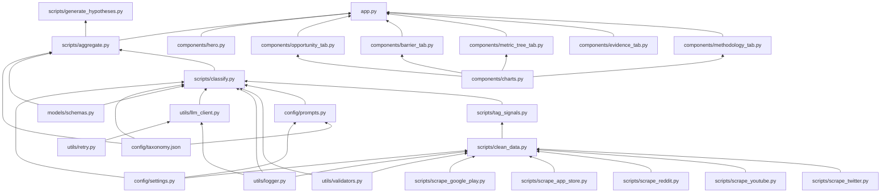

---

## 6. Frontend Design

### 6.1 Data Flow & Caching Strategy

> [!IMPORTANT]
> Streamlit reruns the entire script on every widget interaction. Without caching, the app would reload all data on every click. The caching strategy below prevents this.

```python
"""app.py — data flow pattern"""
import streamlit as st
import pandas as pd
import json
from config.settings import DATA_RESULTS, TAXONOMY_PATH

# ── Cached data loading (runs once, cached until data changes) ──

@st.cache_data
def load_classified_data() -> pd.DataFrame:
    """Load classified.json into a DataFrame. Cached across reruns."""
    with open(DATA_RESULTS / "classified.json") as f:
        data = json.load(f)
    # Flatten classification fields into columns for filtering
    rows = []
    for item in data:
        row = {**item, **item["classification"]}
        del row["classification"]
        rows.append(row)
    return pd.DataFrame(rows)

@st.cache_data
def load_opportunities() -> list:
    with open(DATA_RESULTS / "opportunities.json") as f:
        return json.load(f)

@st.cache_data
def load_taxonomy() -> dict:
    with open(TAXONOMY_PATH) as f:
        return json.load(f)

# ── Dynamic filtering + aggregation ──

def apply_filters(df: pd.DataFrame) -> pd.DataFrame:
    """Apply sidebar filters, return filtered DataFrame."""
    # Filters are reactive — changing a filter triggers rerun
    # But load_classified_data() is cached, so only filtering is recomputed
    return filtered_df

def compute_aggregations(df: pd.DataFrame) -> dict:
    """Compute aggregations on the filtered DataFrame."""
    # This runs on every filter change but is fast on 500 rows
    return aggregations

# ── Render components ──
# Each component receives the filtered DataFrame and config dict

config = {"taxonomy": load_taxonomy(), "opportunities": load_opportunities()}
df = load_classified_data()
filtered_df = apply_filters(df)

render_hero(filtered_df, config)
# ... tabs with render_xxx(filtered_df, config)
```

**Data flow diagram:**

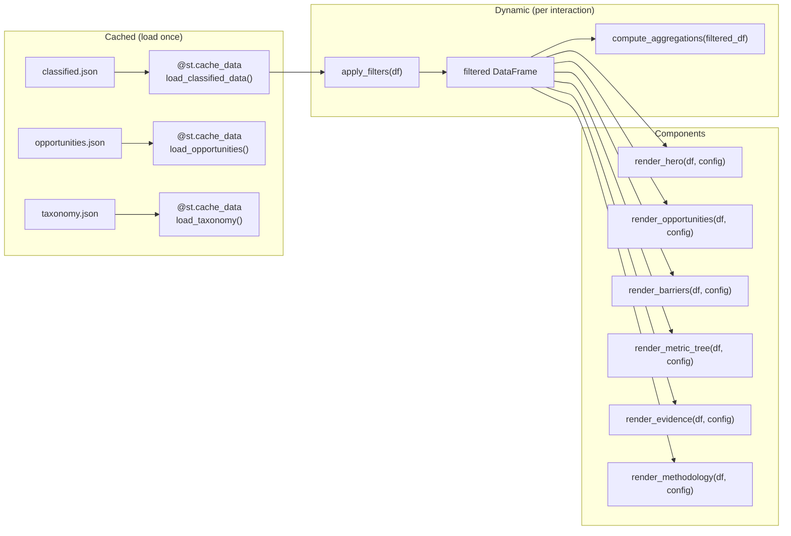

### 6.2 Component Pattern

All frontend components follow the same interface:

```python
"""components/opportunity_tab.py — example component"""
import streamlit as st
import pandas as pd

def render_opportunities(df: pd.DataFrame, config: dict):
    """
    Render the Opportunity Ranking tab.

    Args:
        df: Filtered DataFrame from apply_filters()
        config: Dict with 'taxonomy', 'opportunities', etc.
    """
    opportunities = config["opportunities"]

    for opp in opportunities:
        with st.expander(f"#{opp['rank']} {opp['name']} — Score: {opp['total_score']}", expanded=(opp['rank'] == 1)):
            # Score breakdown, evidence quotes, hypothesis, metric node
            ...
```

### 6.3 Page Layout and Navigation

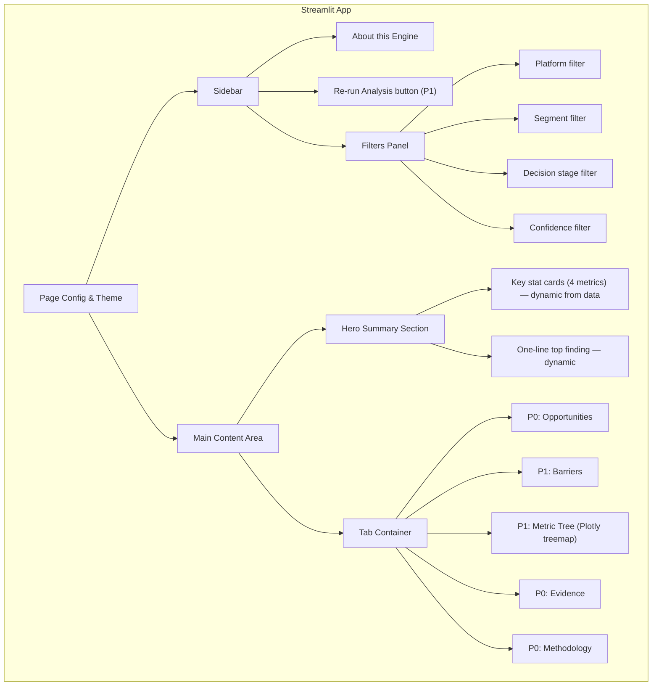

### 6.4 Wireframes

#### Hero Summary Section

```
┌──────────────────────────────────────────────────────────────────────┐
│                                                                      │
│  🔬 Myntra Wishlist Discovery Engine                                │
│                                                                      │
│  ← dynamically computed from aggregated data →                      │
│  "We analyzed {total_reviews} public conversations across            │
│   {platform_count} platforms. The #1 barrier to wishlist conversion  │
│   is {top_barrier} for {top_segment} ({top_pct}% of high-intent     │
│   comments)."                                                        │
│                                                                      │
│  ┌──────────┐  ┌──────────┐  ┌──────────┐  ┌──────────┐           │
│  │  {n}     │  │   {p}    │  │  {pct}%  │  │   {k}    │           │
│  │ Comments │  │Platforms │  │ Top      │  │ Opport-  │           │
│  │ Analyzed │  │ Covered  │  │ Barrier  │  │ unities  │           │
│  └──────────┘  └──────────┘  └──────────┘  └──────────┘           │
│                                                                      │
│  ℹ️ How to read this engine [expandable info panel]                 │
│                                                                      │
└──────────────────────────────────────────────────────────────────────┘
```

#### Tab 1 — Opportunity Ranking (P0)

```
┌──────────────────────────────────────────────────────────────────────┐
│  🎯 Opportunities   📊 Barriers   🌳 Metric Tree   🔍 Evidence   📋│
├──────────────────────────────────────────────────────────────────────┤
│                                                                      │
│  ┌─ #1 ─────────────────────────────────────────────────────────┐   │
│  │  Fit confidence for occasion-led shoppers       Score: 87    │   │
│  │  ████████████████████████████████████░░░░░                   │   │
│  │                                                               │   │
│  │  Freq: ★★★★★  Severity: ★★★★★  Closeness: ★★★★☆            │   │
│  │  Segment: ★★★★☆  Non-discount: ★★★★★                        │   │
│  │                                                               │   │
│  │  146 comments (42.1%) • Primary: Occasion shoppers           │   │
│  │  Metric node: Consideration → Information completeness        │   │
│  │                                                               │   │
│  │  💡 Hypothesis: Users saving outfits for occasions delay     │   │
│  │  because they cannot predict fit on their body type.          │   │
│  │                                                               │   │
│  │  🎙️ Interview Q: "Walk me through the last time you saved   │   │
│  │  an outfit for an event but didn't buy it. What stopped you?" │   │
│  │                                                               │   │
│  │  [▼ Show evidence quotes]                                     │   │
│  └───────────────────────────────────────────────────────────────┘   │
│                                                                      │
│  ┌─ #2 ─────────────────────────────────────────────────────────┐   │
│  │  Quality uncertainty for first-time buyers     Score: 64     │   │
│  │  █████████████████████████░░░░░░░░░░░░░░                     │   │
│  │  ...                                                          │   │
│  └───────────────────────────────────────────────────────────────┘   │
│                                                                      │
└──────────────────────────────────────────────────────────────────────┘
```

#### Tab 2 — Barrier Analysis (P1)

```
┌──────────────────────────────────────────────────────────────────────┐
│  🎯 Opportunities   📊 Barriers   🌳 Metric Tree   🔍 Evidence   📋│
├──────────────────────────────────────────────────────────────────────┤
│                                                                      │
│  ┌─ Overall Barrier Frequency ──────────────────────────────────┐   │
│  │  Fit uncertainty      ████████████████████████  42.1%        │   │
│  │  Quality uncertainty  ████████████████  28.0%                │   │
│  │  Price concern        ██████████████  24.2%                  │   │
│  │  Decision overload    █████████  15.8%                       │   │
│  │  Social validation    ████████  13.5%                        │   │
│  │  Delivery/returns     ██████  11.2%                          │   │
│  │  Styling uncertainty  █████  9.8%                            │   │
│  │  Trust issues         ████  7.1%                             │   │
│  └──────────────────────────────────────────────────────────────┘   │
│                                                                      │
│  ┌─ LEFT: By Platform ──────┐  ┌─ RIGHT: By Segment ───────────┐  │
│  │  [Grouped bar chart]     │  │  [Grouped bar chart]           │  │
│  │  Play Store vs Reddit    │  │  Occasion vs Budget vs         │  │
│  │  vs YouTube vs AppStore  │  │  First-time vs Frequent        │  │
│  └──────────────────────────┘  └────────────────────────────────┘  │
│                                                                      │
│  ┌─ Save Reason → Barrier → Decision Stage (Sankey) ────────────┐  │
│  │  [Plotly Sankey diagram]                                      │  │
│  │  NOTE: Multi-select barriers are exploded into individual     │  │
│  │  flow edges. One comment with 2 barriers = 2 flow edges.     │  │
│  └──────────────────────────────────────────────────────────────┘   │
│                                                                      │
└──────────────────────────────────────────────────────────────────────┘
```

#### Tab 3 — Metric Tree (P1, Plotly Treemap)

```
┌──────────────────────────────────────────────────────────────────────┐
│  🎯 Opportunities   📊 Barriers   🌳 Metric Tree   🔍 Evidence   📋│
├──────────────────────────────────────────────────────────────────────┤
│                                                                      │
│  [Plotly Treemap Visualization]                                      │
│  ┌────────────────────────────────────────────────────────────────┐  │
│  │  Wishlist → Purchase Conversion (30 days)                      │  │
│  │  ┌──────────────────────┬──────────────────────────────────┐  │  │
│  │  │ Wishlist Engagement  │  Consideration → Intent Rate     │  │  │
│  │  │ Rate                 │  🎯 Opp #1 (Fit) • #2 (Quality) │  │  │
│  │  │                      │  🔴 42% barrier                  │  │  │
│  │  │ • Reminders          ├──────────────────────────────────┤  │  │
│  │  │ • Findability        │  Intent → Purchase Rate          │  │  │
│  │  │                      │  🎯 Opp #3 (Social validation)  │  │  │
│  │  │                      │                                  │  │  │
│  │  ├──────────────────────┼──────────────────────────────────┤  │  │
│  │  │ Guardrails           │                                  │  │  │
│  │  │ Return rate • Abandonment • Satisfaction                │  │  │
│  │  └──────────────────────┴──────────────────────────────────┘  │  │
│  └────────────────────────────────────────────────────────────────┘  │
│                                                                      │
│  Implementation: Plotly treemap (replaces streamlit-agraph)          │
│  Click on any cell to see matching opportunities and evidence below  │
│                                                                      │
│  [Matching evidence table appears on click]                          │
│                                                                      │
└──────────────────────────────────────────────────────────────────────┘
```

#### Tab 4 — Evidence Explorer (P0)

```
┌──────────────────────────────────────────────────────────────────────┐
│  🎯 Opportunities   📊 Barriers   🌳 Metric Tree   🔍 Evidence   📋│
├──────────────────────────────────────────────────────────────────────┤
│                                                                      │
│  Search: [_________________]   Barrier: [All ▼]   Stage: [All ▼]   │
│                                                                      │
│  ┌────┬──────────┬─────────────────────────┬────────────┬────────┐  │
│  │ #  │ Source   │ Review Text (truncated)  │ Barriers   │ Stage  │  │
│  ├────┼──────────┼─────────────────────────┼────────────┼────────┤  │
│  │ 1  │ 🟢 Play │ "Loved this but not su…" │ fit, qual  │ eval   │  │
│  │ 2  │ 🔵 Rddt │ "Been eyeing this dre…" │ fit        │ saving │  │
│  │ 3  │ 🔴 YT   │ "I compared this with…" │ quality    │ eval   │  │
│  │ 4  │ 🟡 App  │ "Waiting for the right…"│ price      │ ready  │  │
│  │ …  │          │                          │            │        │  │
│  └────┴──────────┴─────────────────────────┴────────────┴────────┘  │
│                                                                      │
│  [Clicking a row expands to full text + source link + all fields]   │
│                                                                      │
│  Showing 1-20 of 347    [← Prev]  [Next →]                         │
│                                                                      │
└──────────────────────────────────────────────────────────────────────┘
```

#### Sidebar

```
┌──────────────────────┐
│  🔬 Discovery Engine │
│                      │
│  Product: Myntra     │
│  Reviews: {dynamic}  │
│  Last updated:       │
│  {dynamic date}      │
│                      │
│  ─────────────────   │
│  📊 Filters          │
│                      │
│  Platform:           │
│  ☑ Google Play       │
│  ☑ App Store         │
│  ☑ Reddit            │
│  ☑ YouTube           │
│  ☐ Twitter (if avail)│
│                      │
│  Decision Stage:     │
│  [All         ▼]    │
│                      │
│  Confidence:         │
│  [Medium+     ▼]    │
│                      │
│  ─────────────────   │
│  🔄 Re-run Analysis  │
│  [Run on 15 samples] │
│  (P1 feature)        │
│                      │
│  ─────────────────   │
│  ℹ️  About           │
│  📖 Methodology      │
│  ⚠️  Limitations     │
│                      │
└──────────────────────┘
```

---

## 7. Sequence Diagrams

### 7.1 Data Collection Flow

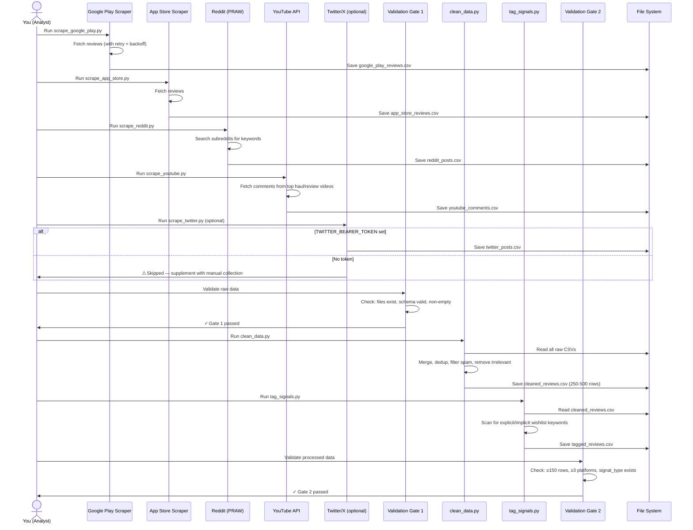

### 7.2 AI Classification Flow

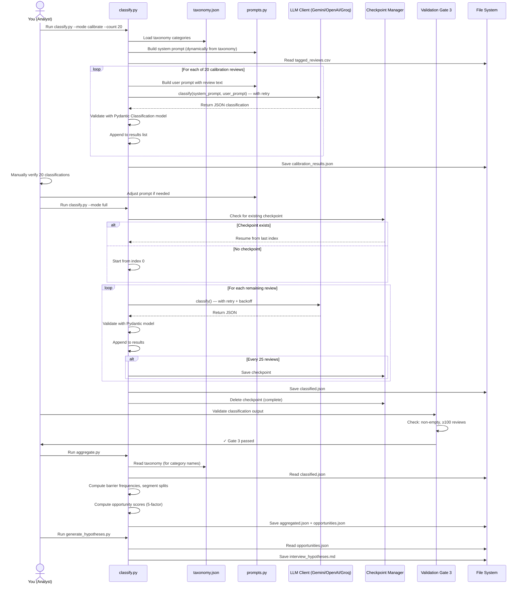

### 7.3 Reviewer Interaction Flow

```mermaid
sequenceDiagram
    actor Rev as Reviewer
    participant ST as Streamlit App
    participant Cache as @st.cache_data
    participant AI as LLM Client (P1: live re-run)

    Rev->>ST: Open public URL
    ST->>Cache: load_classified_data() (cached)
    ST->>Cache: load_opportunities() (cached)
    ST->>Cache: load_taxonomy() (cached)
    ST->>ST: apply_filters(df) — no filters on first load
    ST->>Rev: Render hero summary with dynamic stats

    Rev->>ST: Click "Opportunities" tab
    ST->>Rev: Display ranked opportunity cards with interview questions

    Rev->>ST: Expand Opportunity #1
    ST->>Rev: Show quotes with source links + hypothesis + metric node

    Rev->>ST: Click "Barriers" tab
    ST->>Rev: Display Plotly bar charts (overall, by platform, by segment)

    Rev->>ST: Apply filter: Reddit only
    ST->>ST: apply_filters(df, platform="reddit")
    ST->>ST: compute_aggregations(filtered_df)
    Note over ST: Data loading is cached; only filtering reruns
    ST->>Rev: Update all charts with filtered data

    Rev->>ST: Click "Evidence Explorer" tab
    ST->>Rev: Show searchable/filterable data table

    Rev->>ST: Click source URL on a quote
    Rev->>Rev: Verifies quote on original platform

    Rev->>ST: Click "Metric Tree" tab
    ST->>Rev: Show Plotly treemap with opportunity mappings

    Rev->>ST: Click "Re-run Analysis on Sample" (P1)
    ST->>AI: Send 15 random reviews for live classification
    AI-->>ST: Return classifications
    ST->>Rev: Display live results side-by-side with pre-computed
```

### 7.4 Live Re-run Flow — P1 Feature (Detail)

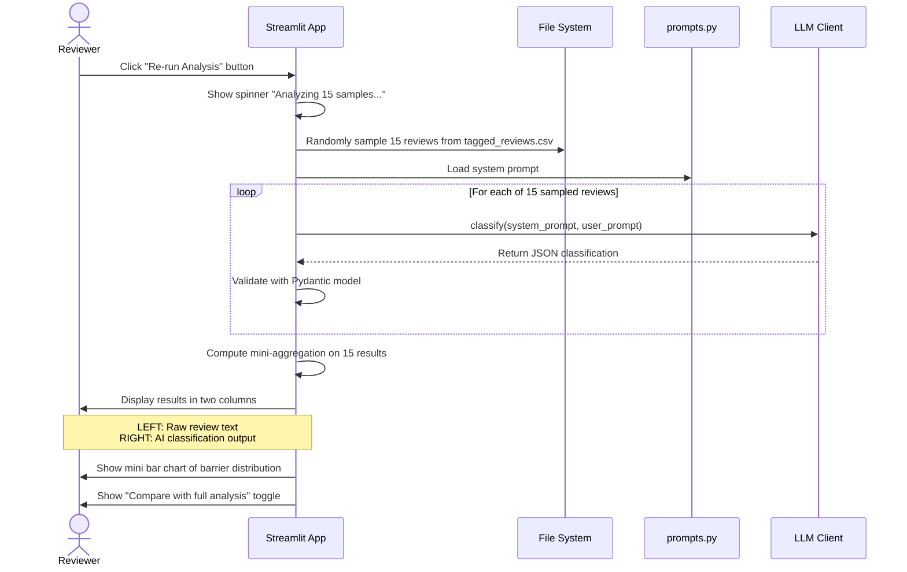

---

## 8. Testing Strategy

### 8.1 Critical-Path Tests (`tests/`)

```python
# tests/test_clean.py
"""Test the cleaning pipeline produces valid output."""

def test_remove_short_reviews():
    """Reviews < 10 chars are removed."""

def test_fuzzy_dedup():
    """Near-duplicate reviews (90%+ similarity) are deduplicated."""

def test_remove_app_bug_reviews():
    """Reviews about crashes/login/loading are filtered out."""

def test_schema_preserved():
    """Output CSV has all required columns."""

def test_empty_input_raises():
    """Empty input raises clear error via validation gate."""
```

```python
# tests/test_tag.py
"""Test signal tagging logic."""

def test_explicit_keywords():
    """'added to wishlist' → signal_type: explicit."""

def test_implicit_keywords():
    """'waiting for sale' → signal_type: implicit."""

def test_general_fallback():
    """No matching keywords → signal_type: general."""

def test_case_insensitive():
    """Matching is case-insensitive."""
```

```python
# tests/test_aggregate.py
"""Test aggregation computations."""

def test_barrier_frequency():
    """Barrier counts and percentages are correct."""

def test_barrier_by_platform():
    """Platform-level breakdown sums to total."""

def test_multi_select_counting():
    """A review with 2 barriers counts toward both."""
```

```python
# tests/test_scoring.py
"""Test opportunity scoring formula."""

def test_score_formula():
    """Score = frequency × severity × closeness × segment × solvability, normalized to 0-100."""

def test_score_normalization():
    """Max possible raw score (5^5 = 3125) maps to 100."""

def test_ranking_order():
    """Opportunities are ranked by total_score descending."""
```

```python
# tests/test_schemas.py
"""Test Pydantic model validation."""

def test_valid_classification():
    """Valid classification JSON passes validation."""

def test_invalid_barrier_rejected():
    """Unknown barrier category is rejected."""

def test_missing_required_field():
    """Missing required field raises ValidationError."""
```

### 8.2 Running Tests

```bash
# Run all tests
python -m pytest tests/ -v

# Run specific test file
python -m pytest tests/test_scoring.py -v
```

---

## 9. Complete Tools Inventory

### 9.1 Development Tools

| Tool | Purpose | Cost | Setup Complexity |
|---|---|---|---|
| **Python 3.10+** | Core language | 🟢 Free | Low |
| **VS Code** | Code editor | 🟢 Free | Low |
| **Git** | Version control | 🟢 Free | Low |
| **GitHub** | Repository hosting + deployment trigger | 🟢 Free | Low |

### 9.2 Data Collection Tools

| Tool | Purpose | Cost | Notes |
|---|---|---|---|
| **google-play-scraper** (Python) | Scrape Google Play reviews | 🟢 Free | `pip install google-play-scraper` — no API key needed |
| **app-store-scraper** (Python) | Scrape App Store reviews | 🟢 Free | `pip install app-store-scraper` — no API key needed |
| **PRAW** (Python) | Reddit API access | 🟢 Free | `pip install praw` — requires free Reddit API credentials (5 min) |
| **YouTube Data API v3** | YouTube comment extraction | 🟢 Free | Free tier: 10,000 units/day (enough). Needs Google Cloud project (free) |
| **tweepy** (Python) | Twitter/X scraping (optional) | 🟢 Free tier | `pip install tweepy` — requires Twitter API credentials |
| **Apify** (alternative) | Multi-platform scraping | 🟡 Free tier, then paid | Free: $5/mo credits on new account. Use only if Python scrapers fail |

### 9.3 AI / LLM Tools

| Tool | Purpose | Cost | Notes |
|---|---|---|---|
| **Google Gemini API (1.5 Flash)** | Review classification (DEFAULT) | 🟢 **Free tier** | Free: 15 RPM, 1M tokens/day. **Recommended default.** |
| **OpenAI API (GPT-4o-mini)** | Alternative LLM | 🟡 Paid ~$0.10 | ~250K tokens ≈ $0.05–0.10 |
| **Groq API (Llama 3.1)** | Alternative LLM | 🟢 Free tier | Very fast inference, free tier generous |
| **OpenRouter** | LLM aggregator | 🟢 Free models available | Access to free models via single API |

> [!IMPORTANT]
> **Default path:** Use **Google Gemini API** (free tier). Classification quality with Gemini 1.5 Flash is comparable to GPT-4o-mini for structured extraction tasks, and it's completely free within limits. Switch via `LLM_PROVIDER=openai` in `.env` if needed.

### 9.4 Frontend & Visualization

| Tool | Purpose | Cost | Notes |
|---|---|---|---|
| **Streamlit** | Web app framework | 🟢 Free | `pip install streamlit` |
| **Plotly** | Interactive charts + treemap + Sankey | 🟢 Free | Replaces `streamlit-agraph` for metric tree |
| **Altair** | Declarative charts (alternative) | 🟢 Free | Simpler alternative to Plotly, native Streamlit support |
| **Pandas** | Data manipulation | 🟢 Free | Core data processing |

### 9.5 Deployment

| Tool | Purpose | Cost | Notes |
|---|---|---|---|
| **Streamlit Community Cloud** | Host the app | 🟢 Free | No credit card. Public URL. Auto-deploys from GitHub |
| **Hugging Face Spaces** | Alternative host | 🟢 Free | Backup option. Supports Streamlit apps natively |

### 9.6 Data Quality & Utilities

| Tool | Purpose | Cost | Notes |
|---|---|---|---|
| **RapidFuzz** | Fuzzy deduplication | 🟢 Free | `pip install rapidfuzz` |
| **langdetect** | Language detection | 🟢 Free | Filter non-English reviews |
| **Pydantic** | Runtime data validation | 🟢 Free | Schema enforcement at pipeline boundaries |
| **python-dotenv** | Environment variable management | 🟢 Free | `.env` file loading |
| **tqdm** | Progress bars | 🟢 Free | Classification progress tracking |
| **pytest** | Testing framework | 🟢 Free | Critical-path tests |
| **Jupyter Notebook** | Exploratory analysis | 🟢 Free | For calibration batch review |

### 9.7 Cost Summary

| Item | Cost |
|---|---|
| All Python packages | Free |
| Data collection (scrapers) | Free |
| AI classification (Gemini free tier) | **Free** |
| AI classification (OpenAI GPT-4o-mini) | ~$0.10 (if you prefer OpenAI) |
| Streamlit deployment | Free |
| GitHub hosting | Free |
| **Total (cheapest path)** | **$0.00** |
| **Total (OpenAI path)** | **~$0.10** |

---

## 10. Full `requirements.txt`

```
# Core
streamlit>=1.30.0
pandas>=2.0.0
plotly>=5.18.0

# LLM clients
google-generativeai>=0.3.0
openai>=1.12.0
groq>=0.4.0

# Data collection
google-play-scraper>=1.2.6
app-store-scraper>=0.3.5
praw>=7.7.0
google-api-python-client>=2.100.0
tweepy>=4.14.0

# Data quality
rapidfuzz>=3.5.0
langdetect>=1.0.9
pydantic>=2.5.0

# Utilities
python-dotenv>=1.0.0
tqdm>=4.66.0

# Testing
pytest>=7.4.0
```

---

## 11. Task Responsibility Matrix

### ✅ What I (AI Agent) can build for you right now

| Task | What I Can Do | Status |
|---|---|---|
| **All scraper scripts** | Complete scripts with retry logic, env var support, logging | ✅ Ready to build |
| **Cleaning pipeline** | `clean_data.py` with dedup, spam filter, relevance filter, validation gates | ✅ Ready to build |
| **Signal tagger** | `tag_signals.py` with keyword matching | ✅ Ready to build |
| **Taxonomy config** | `taxonomy.json` as single source of truth | ✅ Ready to build |
| **Configuration** | `settings.py`, `.env.example`, all config files | ✅ Ready to build |
| **LLM abstraction** | `llm_client.py` with Gemini/OpenAI/Groq support | ✅ Ready to build |
| **AI prompts** | `prompts.py` — reads taxonomy dynamically | ✅ Ready to build |
| **Classification script** | `classify.py` with checkpoint/resume, retry, Pydantic validation | ✅ Ready to build |
| **Pydantic models** | `schemas.py` for all data models | ✅ Ready to build |
| **Aggregation script** | `aggregate.py` reading taxonomy for category names | ✅ Ready to build |
| **Opportunity scorer** | 5-factor scoring formula implementation | ✅ Ready to build |
| **Interview hypothesis generator** | `generate_hypotheses.py` — bridges to Part 3 | ✅ Ready to build |
| **Complete Streamlit app** | Full multi-tab app with caching, filtering, all visualizations | ✅ Ready to build |
| **All UI components** | `render_xxx(df, config)` pattern for all tabs | ✅ Ready to build |
| **Retry + logging utilities** | `retry.py`, `logger.py`, `validators.py` | ✅ Ready to build |
| **Tests** | Critical-path tests for clean, tag, aggregate, scoring, schemas | ✅ Ready to build |
| **Simulated sample data** | Realistic classified data for testing/development | ✅ Ready to build |
| **Verification helper** | `verify.py` — presents random samples for you to check | ✅ Ready to build |
| **Starter review dataset** | Search and compile publicly available reviews from web | ✅ Can do now |
| **Product Q&A template** | CSV template with schema and collection instructions | ✅ Ready to build |

### 🔧 What needs your manual effort

| Task | Why Manual | Time (with buffer) | Notes |
|---|---|---|---|
| **Product choice** | Already decided | ✅ Done | Myntra selected |
| **Reddit API credentials** | Needs your Reddit account | 10–30 min | [reddit.com/prefs/apps](https://www.reddit.com/prefs/apps/) — free. May take 24h for approval. |
| **YouTube API key** | Needs your Google account | 15–45 min | [Google Cloud Console](https://console.cloud.google.com/) — free |
| **Gemini API key** | Needs your Google account | 10 min | [Gemini free tier](https://ai.google.dev/) — recommended |
| **Run the scrapers** | Scripts execute on your machine with your credentials | 30–60 min | I write scripts, you run them. Retry on failure. |
| **Run classification** | Live API calls with your key | 30–60 min | You run `python scripts/classify.py`. Checkpoint resumes on failure. |
| **Manual verification** | Human judgement — the credibility layer | 2–4 hrs | I build a helper tool for efficient review |
| **Adjust opp scores** | Segment clarity + solvability need analyst judgement | 30–60 min | I pre-compute 3 of 5 factors; you adjust 2 |
| **Product Q&A collection** | Browse the app/website manually | 30–60 min | Fill in the CSV template provided |
| **Deploy to Streamlit** | Your GitHub account + Streamlit Cloud link | 15–30 min | Click-through UI, no CLI |

> [!NOTE]
> Time estimates include a **~50% troubleshooting buffer** over the happy-path estimate. Credential acquisition (Reddit, YouTube) is the highest-risk item — start this on Day 1.

### 🌐 What I can simulate or find online

| Task | Approach | Output |
|---|---|---|
| **Starter review dataset** | Compile publicly available reviews from web sources | CSV with 50–100 real public reviews |
| **Simulated classified data** | Generate realistic classified.json for app development | Working dataset to build and test the full UI |
| **Research-backed barriers** | Summarize published UX research on fashion e-commerce | Reference data to validate findings |
| **Interview guide** | Draft the Part 3 interview guide from top opportunities | Ready-to-use interview script |

---

## 12. Exit Criteria Per Phase

| Phase | Exit Criteria | Fallback if Not Met |
|---|---|---|
| **Data Collection** | ≥200 clean reviews from ≥3 source platforms | Supplement with manual web search compilation |
| **Cleaning & Tagging** | `tagged_reviews.csv` passes Validation Gate 2 | Relax min_rows to 150; add manual entries |
| **Calibration** | ≥75% agreement between AI and manual classification on 20 reviews | Adjust prompt; re-run calibration |
| **Full Classification** | `classified.json` passes Validation Gate 3 (≥100 reviews) | Use partial results; note in methodology |
| **Aggregation** | ≥3 ranked opportunities with distinct scores | Merge similar opportunities; re-check taxonomy |
| **Frontend** | All P0 tabs render correctly with real data; public URL loads in <5s | Ship P0 only; cut P1 features |
| **Deployment** | Public URL works in incognito browser; hero loads in <3s | Deploy to Hugging Face Spaces as backup |

---

## 13. Execution Gantt Chart (5-Day Timeline)

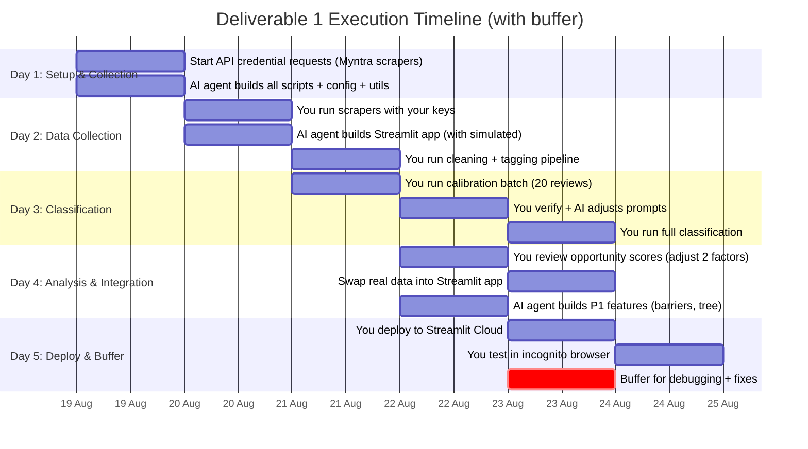

> [!WARNING]
> **Highest risk item:** API credential acquisition (Reddit app approval can take 24h+). Start this on Day 1. If approval is delayed, use the existing starter dataset + manual collection to proceed with classification while waiting.

---

## 14. Slide Deliverable (1 slide in final deck)

The engine produces all data needed for the summary slide:

| Slide Element | Data Source |
|---|---|
| Pipeline diagram | Static visual (left column) |
| Total comments analyzed | `aggregated.json → total_reviews` |
| Number of platforms | `aggregated.json → sources` (count keys) |
| Top 3 opportunities with scores | `opportunities.json` (top 3 entries) |
| Raw → structured example | `classified.json` (pick a clear example) |
| Live engine URL | Streamlit Community Cloud deployment URL |

### Slide layout

```
┌────────────────────────────────────────────────────────────────┐
│  TITLE: [Key finding as the slide title]                       │
│  e.g., "Fit uncertainty blocks 42% of high-intent wishlist     │
│  purchases for occasion shoppers"                              │
├────────────────────────────────────────────────────────────────┤
│                                                                │
│  LEFT COLUMN (40%):                    RIGHT COLUMN (60%):     │
│                                                                │
│  Pipeline diagram:                     Top 3 opportunities     │
│                                        with scores:            │
│  {total} public conversations                                  │
│         ↓                              1. {opp_1_name}         │
│  Cleaning & dedup                         Score: {score}/100   │
│         ↓                                 {pct}% of comments   │
│  AI extraction                                                 │
│  (7-dimension taxonomy)               2. {opp_2_name}          │
│         ↓                                 Score: {score}/100   │
│  Theme & segment clustering               {pct}% of comments   │
│         ↓                                                      │
│  Opportunity scoring                   3. {opp_3_name}         │
│         ↓                                 Score: {score}/100   │
│  Interview hypotheses                     {pct}% of comments   │
│                                                                │
│  Data: {platform_count} platforms,     Example:                │
│  {total}+ comments,                    Raw quote → Structured  │
│  7 extraction dimensions               insight (mini example)  │
│                                                                │
├────────────────────────────────────────────────────────────────┤
│  FOOTER: Link to live engine • Font size 14 • Anonymous        │
└────────────────────────────────────────────────────────────────┘
```

### Slide rules (from requirements)

- Font size: 14 (strictly adhered to).
- No name anywhere on the slide.
- Slide title states the key message, not "Discovery Engine" or "Part 1."
- Background colour must ensure text readability.
- Colour choices must be accessible to colour-blind readers.
- Hyperlink the live engine URL.

---

## 15. Quick Start Command Sequence

Once I've built all the code, here's the sequence you'll run:

```bash
# 1. Setup
cd myntra-discovery-engine
pip install -r requirements.txt
cp .env.example .env
# Edit .env with your API keys (GEMINI_API_KEY, REDDIT_*, YOUTUBE_API_KEY)

# 2. Data collection (run each, takes 2-5 min each)
python scripts/scrape_google_play.py
python scripts/scrape_app_store.py
python scripts/scrape_reddit.py
python scripts/scrape_youtube.py
python scripts/scrape_twitter.py        # Optional — skips if no token

# 3. Validate raw data
python -c "from utils.validators import validate_raw_data; from config.settings import DATA_RAW; validate_raw_data(DATA_RAW, ['source_platform','source_url','date','review_text'])"

# 4. Clean and tag
python scripts/clean_data.py
python scripts/tag_signals.py

# 5. Validate processed data
python -c "from utils.validators import validate_processed_data; from config.settings import DATA_PROCESSED; validate_processed_data(DATA_PROCESSED / 'tagged_reviews.csv')"

# 6. Calibrate AI classification (20 reviews)
python scripts/classify.py --mode calibrate --count 20

# 7. Review calibration output, then run full (resumes from checkpoint on failure)
python scripts/classify.py --mode full

# 8. Aggregate and score
python scripts/aggregate.py

# 9. Generate interview hypotheses
python scripts/generate_hypotheses.py

# 10. Manual verification (interactive)
python scripts/verify.py --sample 30

# 11. Run tests
python -m pytest tests/ -v

# 12. Test locally
streamlit run app.py

# 13. Deploy
git add . && git commit -m "initial engine" && git push
# Then connect repo on share.streamlit.io
```
